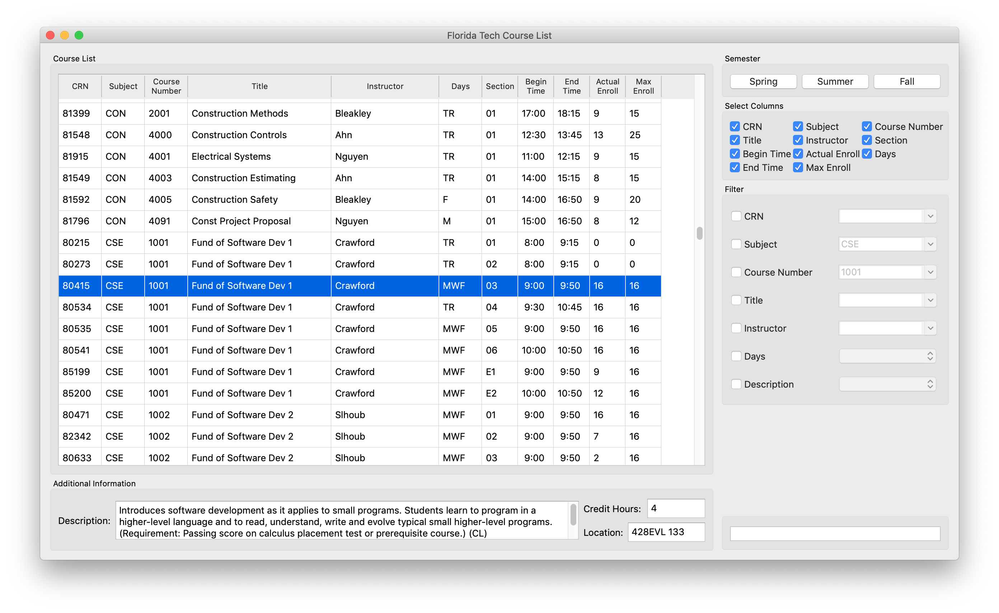
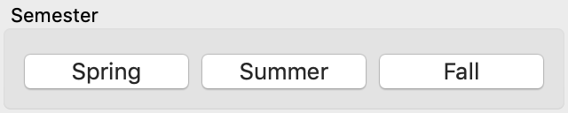
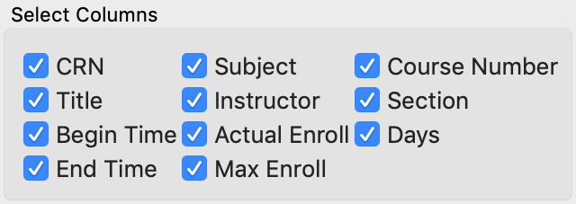
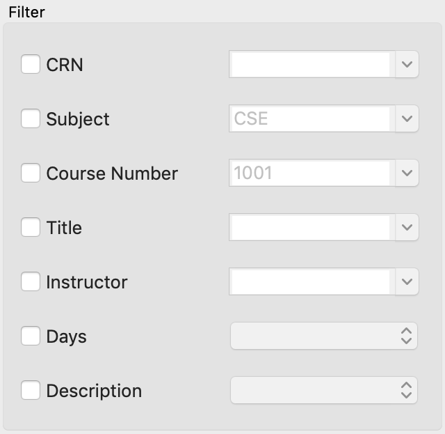
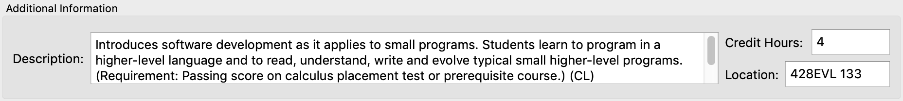

# Florida Tech Course List
Florida Tech Course List is a stand-alone program that allows users to view the course list of Florida Tech.
 

## Highlights
Florida Tech Course List supports multiple functions to ensure a smooth user experience when using the program.

### Navigate Between Course Lists from 3 Semesters
Florida Tech Course List is capable of showing course list from Spring, Summer, and Fall semesters. Simply switch between course lists with a click on the buttons! The course list is always freshly downloaded from Florida Tech server to ensure accuracy.
 

### Focus on the Information You Care
Florida Tech Course List will show all 11 attributes of the courses by default. Options to turn off individual attribute is available.
 

### Instantly Filter Based on Your Choice
Florida Tech Course List is capable of filtering the course list based on 7 attributes. Simply choose from the drop-down list to see courses that match your choice!
 

### Detailed Information is Available
Florida Tech Course List shows the detailed description of any course you select to help with your decision!
 

### Most Importantly, Speed!
When you are tired navigating the puzzling website, Florida Tech Course List comes to your rescue! Florida Tech Course List is designed to be fast and straight-forward and runs as fast as possible on any computer.

## Supported Platforms
Florida Tech Course List is a multi-platform program for everyone!

| OS      | ABI                             | Status                         |
|---------|---------------------------------|--------------------------------|
| Windows | x86-windows-msys-pe-64bit       | Supported, Downloads Available |
| macOS   | x86-darwin-generic-mach_o-64bit | Supported, Downloads Available |
| Linux   | x86-linux-generic-elf-64bit     | Supported                      |

## Downloads
Florida Tech Course List offers pre-compiled binary packages.
* For Florida Tech users, please head to [releases](https://github.fit.edu/zxu2016/FloridaTechCourseList/releases) on [Florida Tech GitHub](github.fit.edu).
* For all other users, please head to [releases](https://github.com/XuZhen86/FloridaTechCourseList/releases) on [Github](github.com).

## How to Install
Due to its nature, Florida Tech Course List requires some tackle before you can use it. But do not worry, you will be fine if you follow the guide!

### For Windows
1. Download the zip file.
1. Unzip the file to your Desktop.
1. Double click the program in the folder and it should run.
1. You are good to go, enjoy the program!
1. NOTE: Please do not remove any files from the folder, even if they seem weird. They are meant to stick together and they stand strong when having each other!

### For macOS
1. Download the zip file.
1. Unzip the file to your Desktop.
1. Double click the program and it should run.
1. You are good to go, enjoy the program!

### For Linux
Unfortunately, there is no pre-built package for downloading. You can clone the repository and build your own copy. The pre-built package for Linux is expected to come later.

## How to Uninstall
It is recommended to completely uninstall the program before installing a newer version.

### For Windows
1. Delete the folder that contains the program.
1. Empty Recycle Bin.

### For macOS
1. Delete the program.
1. Empty Trash.

## Disclaimer
1. The data presented in the Florida Tech Course List program is for viewing only. Please refer to Florida Tech official website for the most up-to-date and accurate data. Although the data presented in the program is expected to be accurate, there is no guarantee that the data is not maliciously modified during data transfer.
1. The Florida Tech Course List program is not intended to replace the role of your counselor and will not help you to register for courses. Please follow the official Florida Tech procedure.
